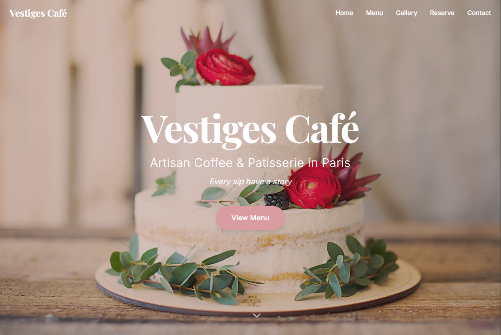

# Vestiges Café - Artisan Kahve & Pastane Web Sitesi



**Vestiges Café**, Paris'in kalbinde yer alan, artizan tatlılar, özel kahveler ve çiçeklerden ilham alan içecekler sunan şirin bir kafe için tasarlanmış modern ve şık bir web sitesidir. Bu proje, kullanıcıların kafenin atmosferini hissetmelerini, menüyü incelemelerini, galeriye göz atmalarını ve rezervasyon yapmalarını sağlayan tek sayfa (one-page) bir tasarıma sahiptir.

## ✨ Öne Çıkan Özellikler

- **Modern ve Şık Tasarım:** `Playfair Display` ve `Inter` font aileleri ile estetik bir görünüm.
- **Tamamen Duyarlı (Responsive):** Mobil, tablet ve masaüstü cihazlarda kusursuz bir deneyim sunar.
- **Dinamik ve Animasyonlu Arayüz:** Sayfa kaydırma ve bileşen yüklemelerinde `fade-in` gibi zarif animasyonlar kullanılmıştır.
- **Bileşen Tabanlı Mimari:** React ile oluşturulmuş, yeniden kullanılabilir ve yönetimi kolay bileşenler (`Navigation`, `Hero`, `Menu`, `Gallery` vb.).
- **Etkileşimli Menü:** Ürünleri ve fiyatları noktalı ayırıcılarla estetik bir şekilde sergileyen menü bölümü.
- **Rezervasyon Formu:** Kullanıcıların kolayca masa rezervasyonu yapabilmesi için bir form.
- **Instagram Entegrasyonu:** Kafe'nin Instagram hesabını ve gönderilerini sergileyen bir bölüm.
- **SEO Dostu:** `index.html` içerisinde meta etiketleri ve `App.tsx` içerisinde JSON-LD schema verileri ile arama motoru optimizasyonu sağlanmıştır.

## 🛠️ Kullanılan Teknolojiler

- **Frontend:** React, TypeScript, Vite
- **Stil:** Tailwind CSS
- **İkonlar:** Lucide React
- **Linting:** ESLint
- **Paket Yöneticisi:** npm

## 🚀 Projeyi Başlatma

Projeyi yerel makinenizde çalıştırmak için aşağıdaki adımları izleyin:

1.  **Depoyu klonlayın:**
    ```bash
    git clone [https://github.com/tunjayoff/ventigescaffee.git](https://github.com/tunjayoff/ventigescaffee.git)
    cd ventigescaffee
    ```

2.  **Bağımlılıkları yükleyin:**
    ```bash
    npm install
    ```

3.  **Geliştirme sunucusunu başlatın:**
    Bu komut projeyi `http://localhost:5173` adresinde çalıştıracaktır.
    ```bash
    npm run dev
    ```

## 📜 Diğer Komutlar

-   **Projeyi Derleme (Build):**
    Projenin üretim için optimize edilmiş versiyonunu `dist` klasörüne oluşturur.
    ```bash
    npm run build
    ```

-   **Lint Kontrolü:**
    Kod stilini ve olası hataları kontrol eder.
    ```bash
    npm run lint
    ```

-   **Derlenmiş Projeyi Önizleme:**
    `dist` klasöründeki üretim versiyonunu yerel bir sunucuda çalıştırır.
    ```bash
    npm run preview
    ```


## 👤 Geliştirici

-   **Tunjayoff**
-   GitHub: [@tunjayoff](https://github.com/tunjayoff)
